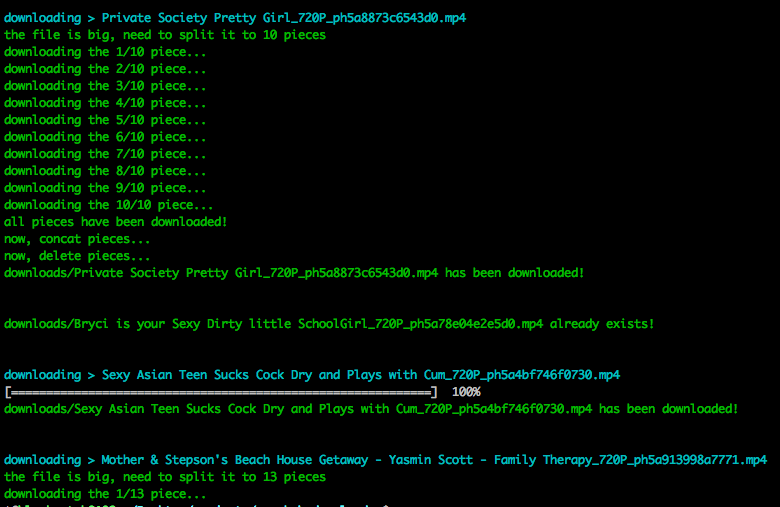

# pornhub-downloader

Download highest quality videos from [pornhub](https://pornhub.com).

**Version 2.x is coming now!**

## statement

**This repo is just for studying, not for other purpose.**

## Screenshots




## Features

* Support proxy setting.

* Always choose highest quality video to download(720P usually).

* Support keyword searching.

* Show progress bar and download speed.

* Skip repeat file.

* Download one by one until error occurs or fetch nothing.

* **Download with custom URLs or custom page.**

* **split big file to pieces, avoid downloading incomplete file**

## Requirement

* Node.js 7.6.0+.

* Your network can access to [pornhub.com](https://www.pornhub.com).

## Usage

* clone this repo.

* install node modules:

```shell
npm install
```

### default

* run

```shell
npm start
```

### custom

If you only want to download specific video(s), you can edit `src/feature/urls.js` like this:

```js
const urls = [
  'https://www.pornhub.com/view_video.php?viewkey=ph5844dbb3a1456'
];
```

> Add your URLs as array.

And then run:

```shell
npm run url
```

## Configuration

You can config some params on `src/config.json`.

`proxyUrl`: set up the proxy with port. For example: `http://127.0.0.1:1087`.
If you don't need to set up proxy,just keep it empty string.

`timeout`: set up request timeout.

`search`: the keyword for searching.

`barWidth`: the progress bar width, should be between 20 to 120, set up 60 by default.

`barFullChar`: the 'finished char' for the progress bar.

`barEmptyChar`: the 'unfinished char' for the progress bar.

`downloadDir`: the directory you want to save videos.

`pathname`: the pathname of the page you want to do download, for example: you want to download files from this page `https://www.pornhub.com/user/xxx/favorite`, then you can set `pathname` as `/user/xxx/favorite`.

## Download speed

The speed depends on your local network or proxy.

## LICENSE

MIT
